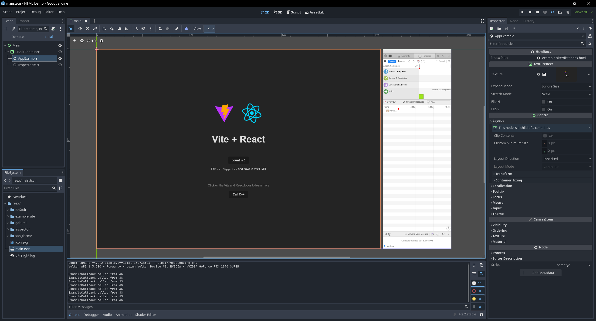

```
⚠️ ONLY TESTED ON WINDOWS ⚠️
This project doesn't include anything that is platform specific.
So there should be no issues.
If someone on x64 Linux/Mac could test, please let me know.
```

# Godot HTML
A GDExtension, using Ultralight, to render HTML.





## Versions
- Godot 4.3+
- Ultralight 1.4.0 Beta

## Table of contents
- [What can this plugin do?](#can-do)
- [What's left to do?](#to-do)
- [Limitations](#ultralight-limitations)
- [Prerequisites](#prerequisites)
- [Project Structure](#project-structure)
- [Building](#building)
  - [Clone godot-cpp](#clone-godot-cpp)
  - [Build Godot C++ bindings](#build-godot-cpp-bindings)
  - [Build plugin](#build-plugin)
- [JS Interop](#js-interop)

## CAN-DO
- Render HTML & CSS, with JS capabilities.
- HTML Inspector
- Mouse & Keyboard Input
- JS Interop
- GDScript Support

## TO-DO
- Accelerated Views. IE. GPU based rendering.
- ImageSource. IE. RenderTargets.
- Make sure remote websites can't access C++ code via JS interop.
- Live code updates (Allow for html to update in the editor when file changed)
- ?? More will arrise I assume ??

## Ultralight Limitations
Ultralight works for most web features. Check out the [missing features](https://github.com/ultralight-ux/Ultralight/issues/178).

Some of the notable limitations are:
- `.webp`
- HTML5 Video/Audio

## Prerequisites
- Setup [compiling](https://docs.godotengine.org/en/stable/contributing/development/compiling/compiling_for_windows.html) for Godot
- Download [Ultralight](https://ultralig.ht/download/)

## Project Structure
Your project should look like this before building the plugin.
```
main_folder/
+--demo/                    # game example/demo to test the extension
  +--addons/                # addons
    +--gdhtml/              # plugin folder
      +--bin/               # plugin build folder / Other libraries
        +--Ultralight.dll
        +--UltralightCore.dll
        +--WebCore.dll
        +--AppCore.dll
      +--resources/         # Ultralight resources folder (Copied from SDK folder)
  +--inspector/             # Ultralight inspector folder (Copied from SDK folder)
+--godot-cpp/               # C++ bindings
+--src/                     # Source code of the extension we are building
+--ultralight/              # Ultralight SDK
```

## Building

### Clone godot-cpp
```
git submodule update --init --remote
```

### Build Godot C++ bindings
```
cd godot-cpp
scons platform=<platform>
```

### Build plugin

From the main folder.
```
scons platform=<platform>
```

## JS Interop
JS interop is as simple as returning a `Dictionary` from the virtual function `_on_dom_ready`. Then accessing it from JS using `window.godot`.

Checkout the [example](demo/app_example.gd) script.

Important:
- JS Symbols are not currently supported. Convert them to a string before passing them to Godot.

## Exporting Godot Project
Once you're ready to export your game/project make sure to:
<table>
  <tr>
    <td>Include html files in export via `Export Configuration`.</td>
    <td></td>
  </tr>
  <tr>
    <td>For auto imported resources, select `Keep File (No Import)`.</td>
    <td></td>
  </tr>
<table>
